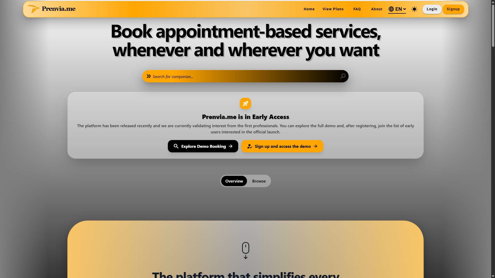
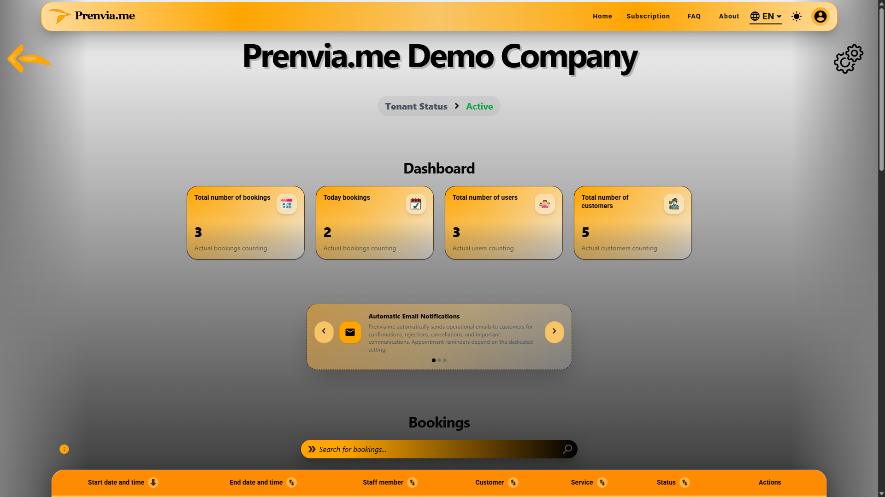
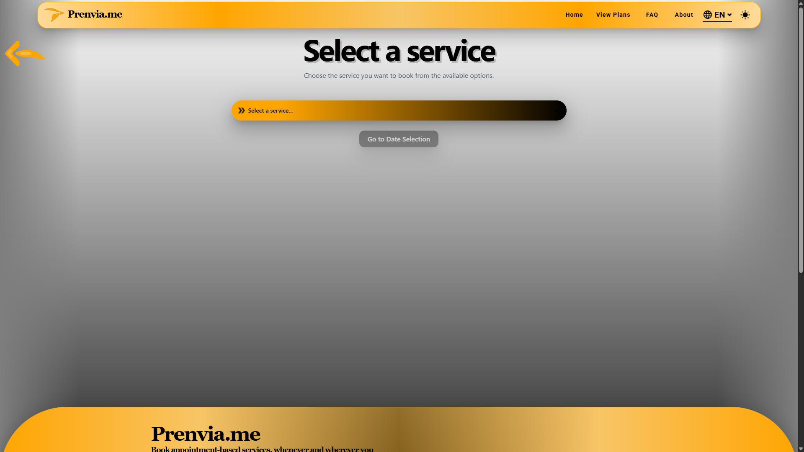
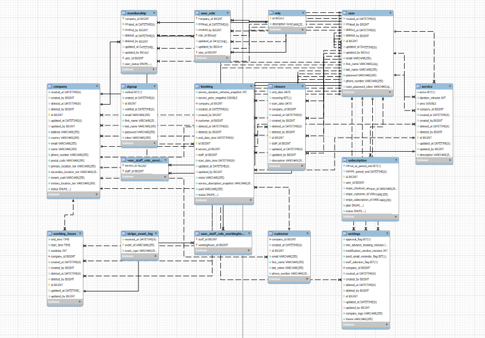

<p align="center">
  <a href="README.md">
    
  </a>
  <a href="README.it.md">
    
  </a>
</p>

<h1 align="center">Prenvia.me</h1>

<p align="center">
  <strong>Multi-Tenant Appointment Booking SaaS</strong>
</p>

<p align="center">
  Appointment booking platform for salons, barbers, beauty professionals and appointment-based businesses.
</p>

<p align="center">
  🌐 <a href="https://prenvia.me">Live Platform</a> •
  🚀 Built from scratch •
  🔒 Multi-Tenant Architecture •
  💳 Stripe Billing
</p>

<p align="center">
  ⚠️ Currently available in Early Access
</p>

<p align="center">
  
  
  
  
  
</p>

---

## Screenshots

<p align="center">
  
  
  
</p>

---

## Repository Notice

This public repository does not contain the Prenvia.me source code.

The complete application is actively developed and maintained in private repositories.

This repository is provided exclusively as a project showcase and contains documentation, screenshots and high-level technical information about the platform.

---

## Overview

Prenvia.me is a platform built to help appointment-based businesses manage bookings, services, staff availability and customer appointments through a modern web experience.

Prenvia.me started as a personal engineering challenge outside my full-time work as a Java Developer.

I wanted to build something that would push me beyond day-to-day development tasks and allow me to experience the entire product lifecycle: from the first idea on paper to architecture design, business logic, database modeling, frontend development, deployment and infrastructure management.

Before writing code, I spent time defining workflows, user roles, permissions, booking rules, subscription models and the overall system architecture. The goal was never to create a quick prototype, but to build a production-ready SaaS platform with solid foundations.

What began as a learning project gradually evolved into something much bigger. As the platform matured, I realized it had real commercial potential and decided to turn it into a serious product.

Today, Prenvia.me represents both my software engineering journey and my ambition to build digital products that solve real business problems.

---

## Key Features

* Online appointment booking
* Multi-tenant architecture
* Public booking pages
* Staff and availability management
* Service management
* Booking approval workflows
* Subscription billing with Stripe
* Responsive design
* Internationalization (IT, EN, DE, FR, ES)
* Secure authentication and authorization
* Role-based access control
* Business customization and branding
* Customer management
* Email notifications and reminders

---

## Technology Stack

### Frontend

* Angular 20
* Angular Material
* TypeScript
* Tailwind CSS
* RxJS

### Backend

* Java 21
* Spring Boot
* Spring Security
* Spring Data JPA
* Hibernate
* REST APIs
* JWT Authentication

### Database

* MySQL

### Infrastructure

* Docker
* Coolify
* Hetzner Cloud
* Cloudflare

### Integrations & Services

* Stripe
* Firebase Storage
* GeoNames
* Email Services

---

## Architecture

```text
Customer / Business Owner
            │
            ▼
     Angular Frontend
            │
            ▼
     Spring Boot API
            │
            ▼
          MySQL
            │
            ├── Stripe Billing
            ├── Firebase Storage
            ├── Email Services
            └── GeoNames Integration
```

### Database Architecture

The following diagram illustrates the core domain model and relationships that support Prenvia.me's multi-tenant architecture.

<p align="center">  </p>

Prenvia.me follows a multi-tenant SaaS architecture where each business operates within its own isolated environment.

Each tenant maintains independent:

* Services
* Staff members
* Customers
* Business settings
* Availability schedules
* Bookings

The platform also implements role-based access control, subscription lifecycle management, secure authentication, and external service integrations while maintaining logical data isolation across tenants.

---

## Development Journey

The project was developed through several phases:

1. Product idea and business analysis
2. System architecture and domain modeling
3. UI/UX design and user flows
4. Backend development with Spring Boot
5. Frontend development with Angular
6. Multi-tenant implementation
7. Stripe subscription integration
8. Infrastructure, deployment and security
9. Continuous testing and refinement

---

## Why This Project Matters

In an era where software can often be generated with a few prompts, Prenvia.me represents a hands-on engineering journey.

This project was designed, architected and developed as a deliberate engineering exercise to deepen my understanding of software architecture, scalability, security, SaaS business models and product development.

Every feature, workflow and technical decision became an opportunity to learn, improve and gain real-world experience beyond my daily work.

More than just a booking platform, Prenvia is the project through which I continue to grow as an engineer, founder and builder.

---

## Current Status

Prenvia.me is currently available in Early Access:

👉 https://prenvia.me

The platform is fully operational and all core features have been implemented, tested and validated.

At this stage, the only remaining piece before the official commercial launch is the completion of the billing and invoicing workflow required to support paying customers.

In parallel, I am finalizing the surrounding ecosystem that will support the public launch of the platform, including my personal portfolio and business presence. Once everything is in place, Prenvia.me will move from Early Access to its official public launch.

What started as a personal engineering challenge has evolved into a real SaaS product, and the platform is now approaching the final steps before becoming publicly available to businesses.

---

## Author

**Diego Mezzo**

Full Stack Software Engineer  
Founder of Prenvia.me

📧 dev@diegomezzo.com

💼 https://www.linkedin.com/in/diego-mezzo-748094270
